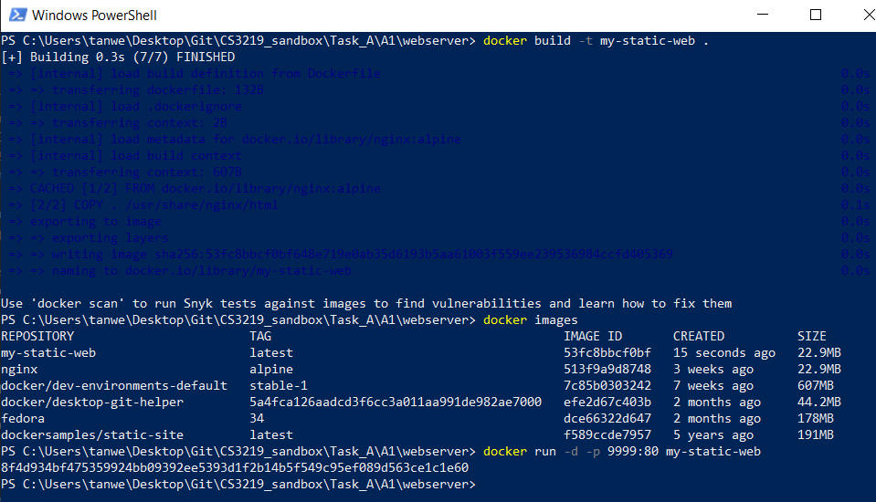
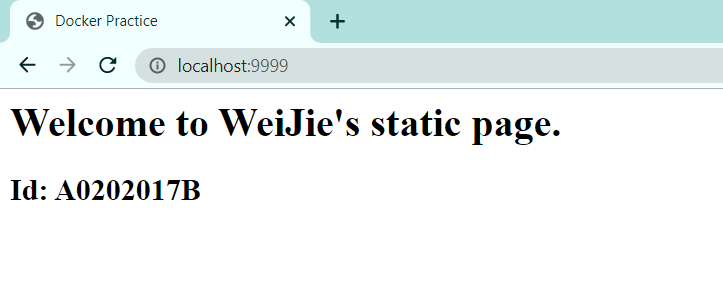
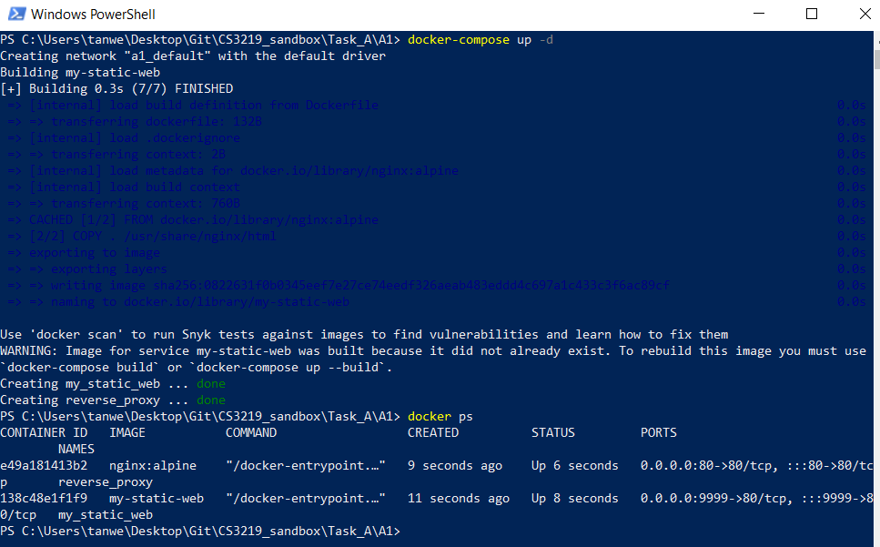
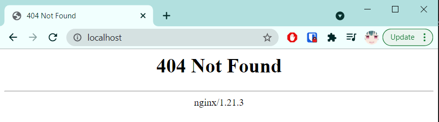
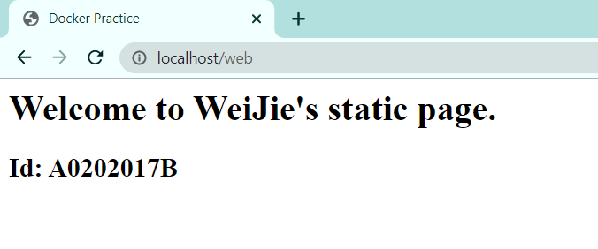

# Project Details
Task: A1  
Done by: Tan Wei Jie (A0202017B)  
Repo Link: https://github.com/tanweijie123/CS3219_Sandbox/tree/main/Task_A/A1  

# Instructions on how to run

## Instructions on how to run the one static page webserver only 
1. Change Directory to `A1/webserver/`. You should see a Dockerfile in this directory. 
1. Run the dockerfile using `docker build -t my-static-web .` where `my-static-web` is the name given to the image. 
1. To check if the build is successful, run `docker images` and ensure that `my-static-web` is there. 
1. Run the command `docker run -d -p 9999:80 my-static-web` to run docker and use the port 9999 to access. 
1. Open the web browser and check that `http://localhost:9999/` is showing the `index.html` of this directory. 

  
  

## Instructions on how to set up reverse proxy 
1. In this directory, run `docker-compose up -d` to allow docker to create a network between the 2 dockers (webserver and reverse_proxy).  
The command will:  
    - Perform a docker build in `./webserver` and name this image `my-static-web`
    - Pull `nginx:alpine` from docker library and map the `nginx.conf` into the reverse proxy docker settings. 

  

2. Check that to directly access `my-static-web`, you have to use port 9999. Using port 80 will not work. 

  
  

3. Using the reverse proxy, we can access `my-static-web` via `http://localhost/web`. This will utilise the reverse proxy mapping and not directly access `my-static-web` using port 9999. 

  

# Learning Points
- Since the webserver is using an image which has a default web, this project utilise this and overwrite the default page, hence the Dockerfile do not have extra steps like `EXPOSE` or `npm install`.  
- Need to add a `/` at the back of the reverse proxy link, otherwise, the `/web` will be forwarded to `my-static-web`, resulting in page not found. 

# Resources
Resources that are used and referred to during the creation of this project. 

|Desc|Link|
|---|---|
|Docker Tutorial| https://github.com/docker/labs/blob/master/beginner/chapters/setup.md |
|Docker and Nginx Reverse Proxy Video | https://youtu.be/hxngRDmHTM0 | 
