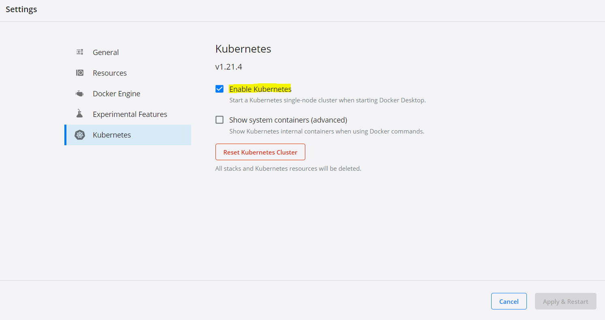
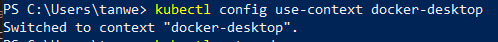
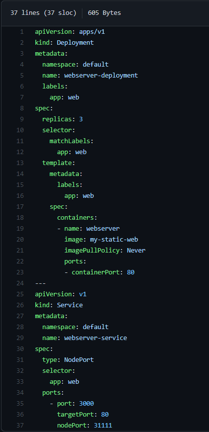

# Project Details
Task: A2  
Done by: Tan Wei Jie (A0202017B)  
Repo Link: https://github.com/tanweijie123/CS3219_Sandbox/tree/main/Task_A/A2

# Instructions on how to run
1. For my project, I will be using Docker Desktop with Kubernetes. As a start, ensure that Kubernetes is enabled on your Docker Desktop. You can do that by going to Docker Desktop > Settings, check on "Enable Kubernetes".  
  
1. Next, check that your kubernetes is using the `docker-desktop` environment. You can do this by entering `kubectl config use-context docker-desktop`.  
  
1. Build the docker image that you want to use for kubernetes. In this example, I will use the webserver image I used for [Task A1](https://github.com/tanweijie123/CS3219_Sandbox/tree/main/Task_A/A1/webserver). Run `docker build <directory_of_Dockerfile> -t my-static-web`  
  
1. Once the build is complete, execute `kubectl apply -f ./deployment-service.yml` to setup kubernetes configuration. Verify that you have 3 running pods for the `webserver-service` service. You should also note that port 31111 is exposed due to the `deployment-service.yml` configuration.  
  
  
1. After running the above command, a browser will pop up with the assigned port. In this case, you can access the service at `http://localhost:31111/`.  
  
1. To close kubernetes deployment and services, run `kubectl delete -f ./deployment-service.yml`.  

# Learning Points
- In order to use locally created images, I need to set `imagePullPolicy: Never` and enable Docker Desktop's Kubernetes settings. 
- Kubernetes are usually run on cloud, it is rarely run locally. 

# Resources 
Resources that are used and referred to during the creation of this project. 

|Desc|Link|
|---|---|
|How to Run Locally Built Docker Images in Kubernetes|https://medium.com/swlh/how-to-run-locally-built-docker-images-in-kubernetes-b28fbc32cc1d|
|To expose port of service in Minikube|https://stackoverflow.com/questions/40767164/expose-port-in-minikube| 
| Deploy Docker Desktop on Kubernetes | https://docs.docker.com/desktop/kubernetes/ |  