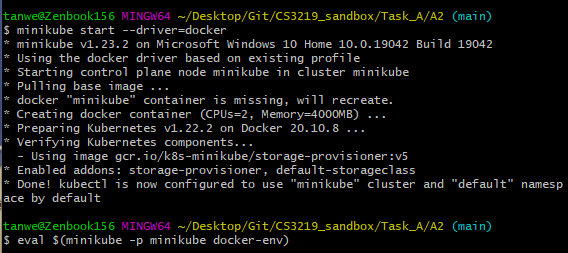
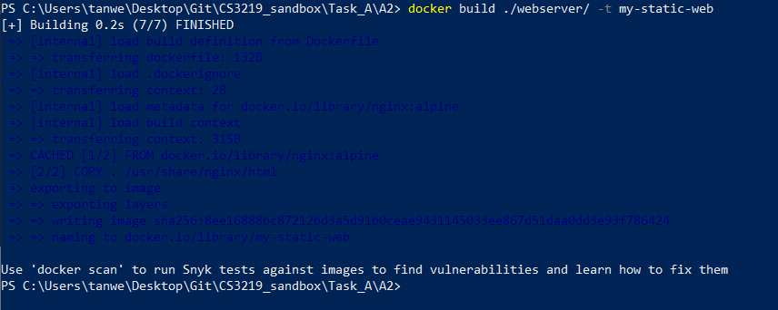
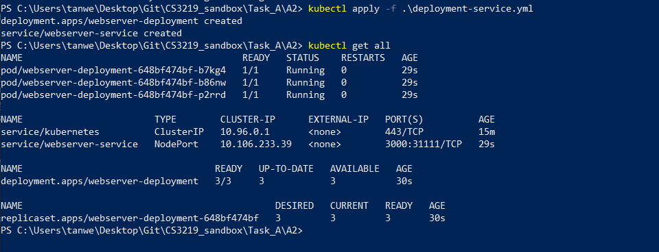
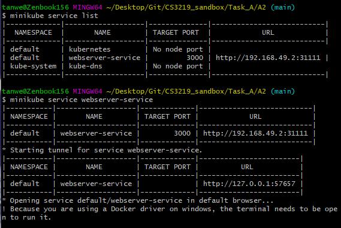
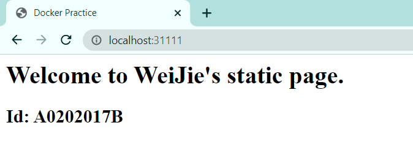

# Project Details
Task: A2  
Done by: Tan Wei Jie (A0202017B)  
Repo Link: https://github.com/tanweijie123/CS3219_Sandbox/tree/main/Task_A/A2

# Instructions on how to run
1. For my project, I will use minikube as the deployment node. So to start minikube, run `minikube start --driver=docker`. This will create a minikube docker.  
1. Once it has created the minikube docker, run `eval $(minikube -p minikube docker-env)` to copy the docker environment into minikube.  
  
1. Build the docker image that you want to use for kubernetes. In this example, I will use the webserver image I used for [Task A1](https://github.com/tanweijie123/CS3219_Sandbox/tree/main/Task_A/A1/webserver). Run `docker build <directory_of_Dockerfile> -t my-static-web`  
  
1. Once the build is complete, execute `kubectl apply -f ./deployment-service.yml` to setup kubernetes configuration. Verify that you have 3 running pods for the `webserver-service` service. You should also note that port 31111 is exposed.  
  
1. In this step, I will try to connect to the deployed image. Since I am using minikube for deployment node, I will need to connect the kubernetes service to minikube so that I can access it on my computer. Run `minikube service webserver-service`.  
  
1. After running the above command, a browser will pop up with the assigned URL. In this case, minikube assigned the service to `http://localhost:57657/`.  
  
1. To close kubernetes deployment and services, run `kubectl delete -f ./deployment-service.yml`.  

# Learning Points
- In order to use locally created images, I need to set `imagePullPolicy: Never` and minikube to point to local Docker daemon. 
- Need to run eval $(minikube -p minikube docker-env) for every new `minikube start`. 
- Kubernetes are usually run on cloud, it is rarely run locally. 

# Resources 
Resources that are used and referred to during the creation of this project. 

|Desc|Link|
|---|---|
|How to Run Locally Built Docker Images in Kubernetes|https://medium.com/swlh/how-to-run-locally-built-docker-images-in-kubernetes-b28fbc32cc1d|
|To expose port of service in Minikube|https://stackoverflow.com/questions/40767164/expose-port-in-minikube| 