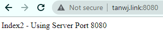
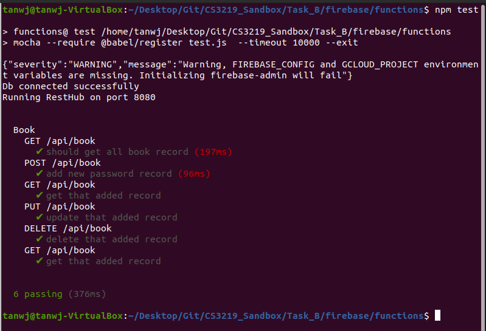

# Project Details
Task: B1 - B4  
Done by: Tan Wei Jie (A0202017B)  
Repo Link: https://github.com/tanweijie123/CS3219_Sandbox/tree/main/Task_B  
Backend Link: http://tanwj.link:8080/api/book  
Frontend Link: http://tanwj.link:3000/  
Autodeployment Link: https://asia-southeast1-cs3219b.cloudfunctions.net/api/api/book  

*Note: All of the data use the same database at tanwj.link:27017*  

# Overview 
This project is about creating a password manager using React App for frontend, REST API for backend CRUD operations, and MongoDB for data storage.  
Each log contains a website, id and password used for the website. 

## Task B1: A simple backend using REST API

### /GET
When the backend is accessed, it will perform a `/GET` operation. This will list all the passwords currently stored in this application.  

### /POST to add website
To add a website, perform a `/POST` operation.  

### /GET for individual item
To perform a `/GET` for individual items, append the website name to the url. Note that each website name is unique.  

### /PUT to edit a website
To edit a website, use `/PUT` with the website name appended to the url. For example, in this case, we changed the password from `pass1234` to `password1`.  

### /DELETE to delete a website
To delete a website, use `/DELETE` with the website name.  

### Some edge cases 
1. Trying to insert same website name.  
  
In this system, website names are the "primary key". In this example, we try to insert another `nusmail.com` website, but since the website already exist, it will reply with a message, "Site name already exist. Use another name for this site."  

2. Trying to access unavailable website.  
  
In the `/DELETE to delete a website`, we had deleted `WritingReadMe` website, so if we were to access it again, it will reply with a status 404 with a message "Site details not found..."  
  

3. Trying to insert / update without full details. 
  
In this system, we require website name, id and password to be filled. If there are empty fields, it will return a error message "name, id, pw are required."  
  
  

4. Trying to delete non-existent website.  
  
Since website name are unique, there are only 1 or 0 entry with such website name. As such, when trying to delete a non-existent website, it will return success with deleteCount: 0. Note that this message is different from the `/DELETE to delete a website` step.  
  

## Task B2: Testing using CI
In this step, we test the backend using Mocha/Chai and Github Actions as the automating tester.  
  

## Task B3: Deployment through CD
In this step, we use Google Functions as the serverless service and autodeploy our functions when commit. It will automatically deploy the function to `https://asia-southeast1-cs3219b.cloudfunctions.net/api/api/book`  

  
  
  

## Task B4: Frontend
In this step, we use React with Bootstrap to create a simple frontend to handle the request.  
  

# Instructions on how to run 
In this section, we will go through through how to run the application given that you have downloaded from the [repo link](https://github.com/tanweijie123/CS3219_Sandbox/tree/main/Task_B)  

## Task B1
1. Run `npm install` to download the dependencies
1. Run `node index2` to start the server. *Note: index is used for Google Functions (serverless deployment), and index2 is used for local deployment.*
1. When you access [it](http://tanwj.link:8080), it will display an introduction message, and the main backend is at `/api/book`. 
  
  

1. For demo of GET, POST, PUT, DELETE functions using Postman, refer to the overview section [here](#task-b1-a-simple-backend-using-rest-api).   

## Task B2
1. To run the test locally, run `npm test` in the working directory. You should see this screen.  
  
1. If you insert this `.yml` file into the `.github/workflows/` directory, Github Actions will automate the testing for you. The `.yml` used can be found [here](https://github.com/tanweijie123/CS3219_Sandbox/blob/main/.github/workflows/b_testing.yml).  
  

## Task B3 
For this step, it is simple to setup a continuous deployment to Google Functions. 
1. Create a trigger on Google Functions. 
  
1. Add the `.yml` file into your repo root so it will automatically trigger the deployment. The `.yml` used can be found [here](https://github.com/tanweijie123/CS3219_Sandbox/blob/main/cloudbuild.yml).  
  

For both steps above, you can refer to the one-time setup instructions [here](https://cloud.google.com/build/docs/deploying-builds/deploy-functions#continuous_deployment).  
  
## Task B4
1. Run `npm install` to download the dependencies
1. Run `npm start` to start the webpage. 

# Conclusion
You can test the project live using the links given in the [Project Details](#project-details).  

# Resources
Resources that are used and referred to during the creation of this project. 

|Desc|Link|
|---|---|
|Guide on how to create a simple REST API with express|https://medium.com/@dinyangetoh/how-to-build-simple-restful-api-with-nodejs-expressjs-and-mongodb-99348012925d|
|Google Function's Continuous Deployment Guide|https://cloud.google.com/build/docs/deploying-builds/deploy-functions|
|Creating a basic React App|https://www.datarmatics.com/reactjs/|
|Video on React with REST API|https://youtu.be/qXvFaEkkZH8|
|Making API calls in React App|https://www.kindsonthegenius.com/how-to-make-rest-api-calls-in-react-get-post-put-delete/|
|React with Bootstrap|https://react-bootstrap.github.io/getting-started/introduction/|
