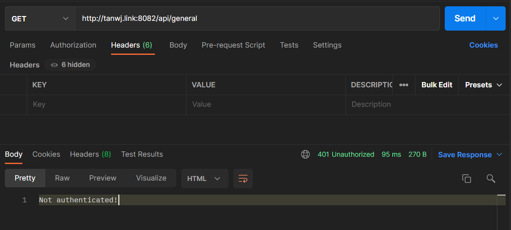
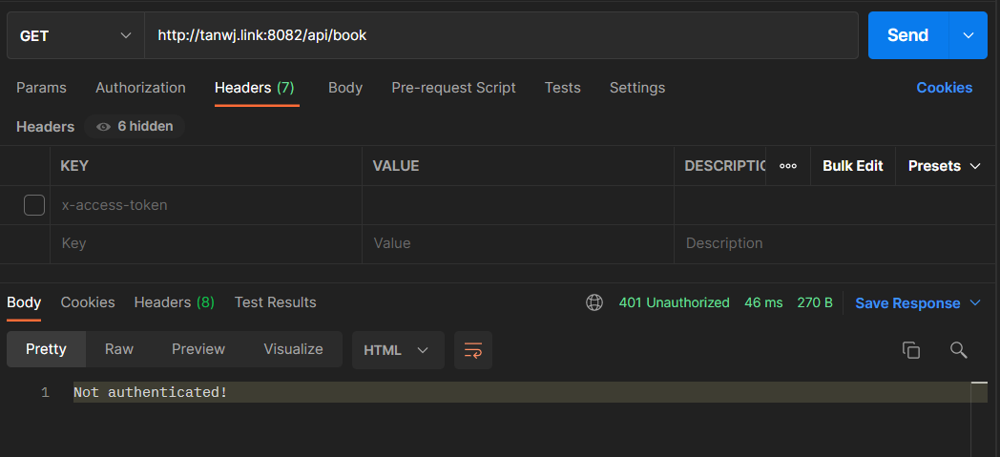
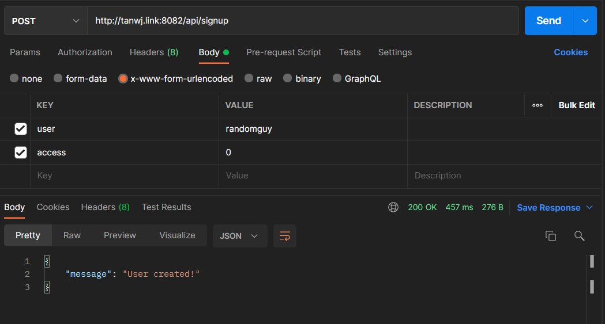
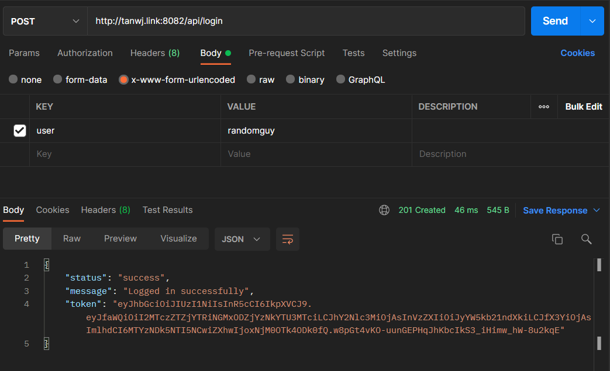
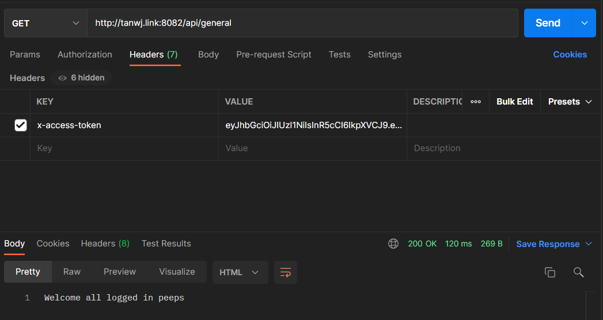
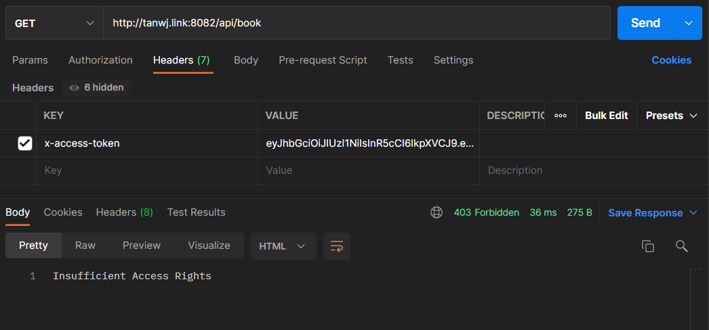
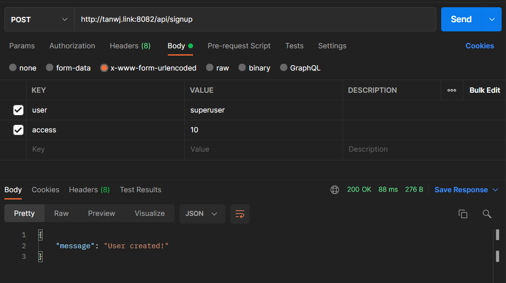
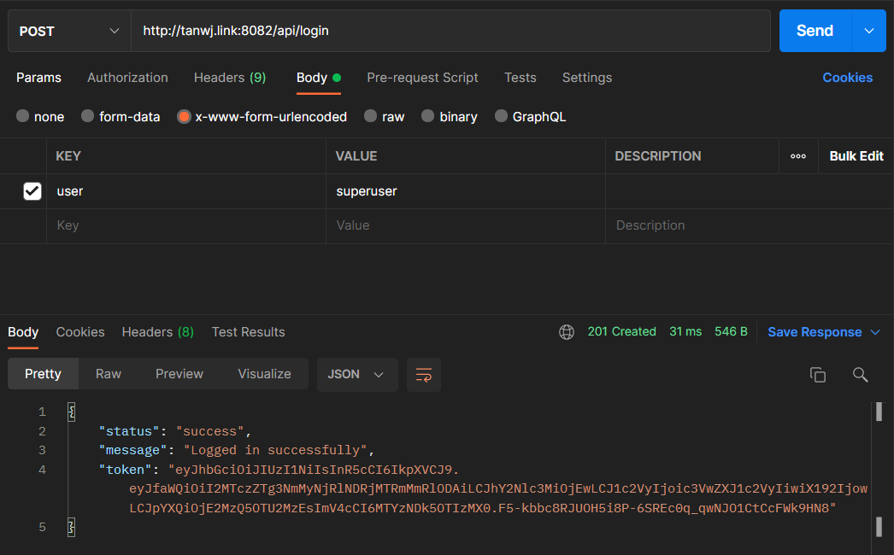
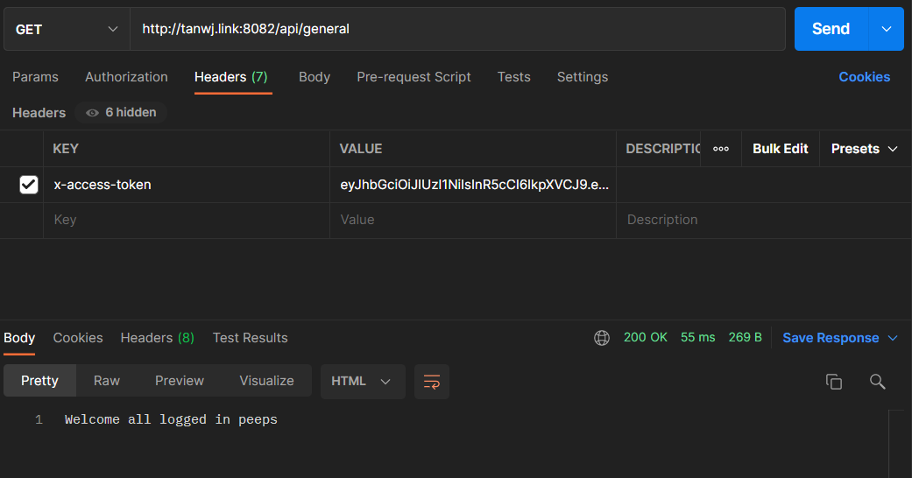
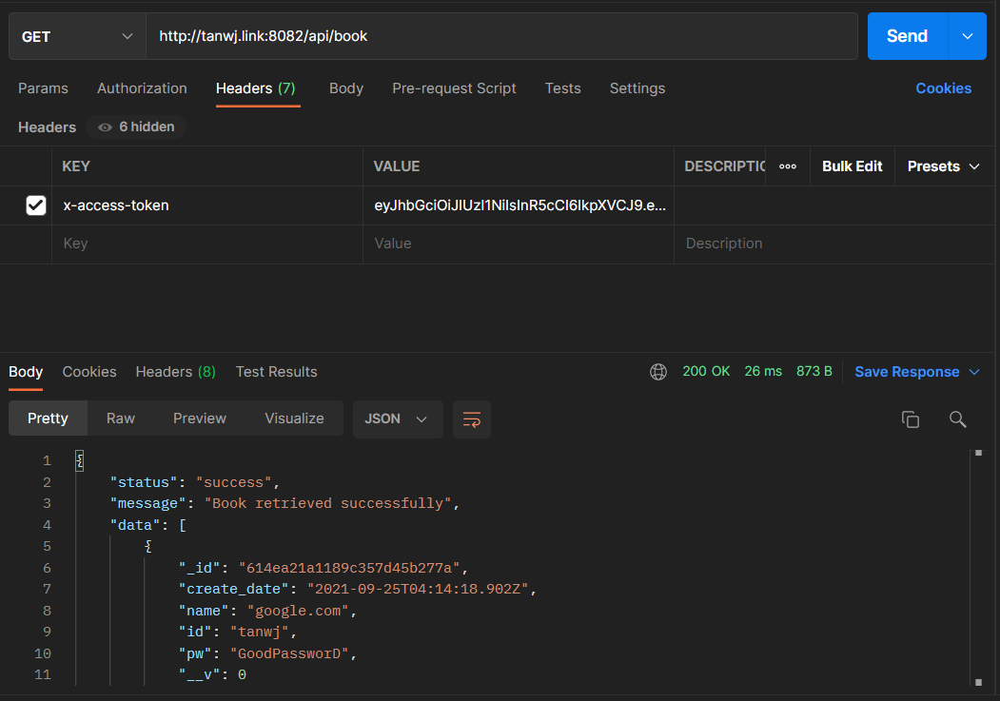

# Project Details
Task: C  
Done by: Tan Wei Jie (A0202017B)  
Repo Link: https://github.com/tanweijie123/CS3219_Sandbox/tree/main/Task_C  
Backend Link: http://tanwj.link:8082/api/general  

*Project is based on Task B, but added authorization and authentication.* 

# Background Information
* Password Manager (`/api/book`) can only be accessed by User with 1 and higher priviledge.  
* General Access (`/api/general`) can be accessed by any logged in users.  
* Sign up (`/api/signup`) and Log in (`/api/login`) can be accessed by any user.  

# Overview
1. When you accessed the restricted links, it will return a **Not authenticated!** reply.  
  
  
1. In this step, I will create a user with 0-level access rights.  
  
1. By using this username, I will try to log in to the system. After logging into the system, it will return me with a token.  
  
1. By using this token, I will try to access the General Access and Password Manager. Note that this account is unable to access the Password Manager due to insufficient access rights.  
  
  
1. In this step, I will create a superuser with 10-level access rights.  
  
1. By using this username, I will try to log in to the system. After logging into the system, it will return me with a token.  
  
1. By using this token, I will try to access the General Access and Password Manager. Note that this account will be able to access the Password Manager and General Acccess.  
  
  

