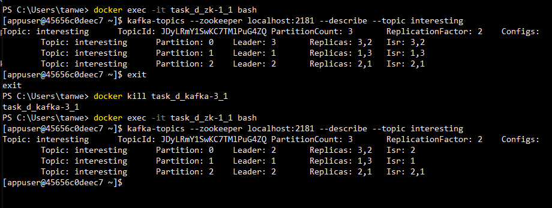

# Project Details
Task: D  
Done by: Tan Wei Jie (A0202017B)  
Repo Link: https://github.com/tanweijie123/CS3219_Sandbox/tree/main/Task_D

# Implementation of Pub-Sub System using Apache Kafka
1. In this [docker compose file](https://github.com/tanweijie123/CS3219_Sandbox/blob/main/Task_D/docker-compose.yml), it will create 1 Zookeeper and 3 Kafka cluster setup.   
1. To start the system, run `docker-compose up -d` on this directory. You should see a network is being created.  
  
1. To create a messaging channel, open bash in 1 of the nodes with `docker exec -it task_d_kafka-1_1 bash`.  
1. I will be creating a topic called `interesting`. To do this, run `kafka-topics --create --zookeeper zk-1:2181 --replication-factor 2 --partitions 3 --topic interesting`.  
1. To check if it is set up correctly, you can run `kafka-topics --list --zookeeper zk-1:2181` to list all the open topics.  
  
1. To send message over `interesting` topic, run `kafka-console-producer --broker-list localhost:9092 --topic interesting`.  
1. You can receive the message in another node. To receive message from `interesting` topic, run `kafka-console-consumer --bootstrap-server localhost:9092 --topic interesting --from-beginning`.  
  

# Another node takeover 
1. Using this command `kafka-topics --zookeeper localhost:2181 --describe --topic interesting`, we can find the leader of the topic. 
1. To check if another node will take over its place, I had killed off the leader 3.  
  
1. After displaying the error of not being able to connect to `kafka-3`, the producer and consumer are still able to communicate over `interesting` topic.  
  

# Resources 
Resources that are used and referred to during the creation of this project. 

|Desc|Link|
|---|---|
|Kafka Docker Setup | https://www.baeldung.com/ops/kafka-docker-setup| 
|Kafka Command Line Tutorial | http://cloudurable.com/blog/kafka-tutorial-kafka-from-command-line/index.html| 