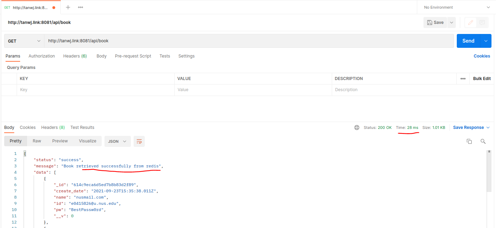
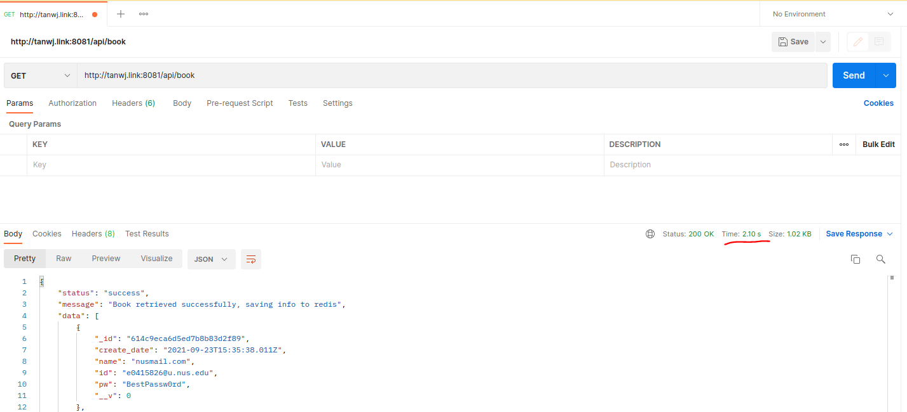

# Project Details
Task: F  
Done by: Tan Wei Jie (A0202017B)  
Repo Link: https://github.com/tanweijie123/CS3219_Sandbox/tree/main/Task_F  
Backend Link: http://tanwj.link:8081/api/book  

*Project is based on Task B, but added busy waiting by 2 seconds during intial access.*  

# Overview
When you first access the link, it will take a long time to process data. On the subsequent visit, the server will return the cached data, hence lowering the time required to return an answer.  

Information: 
- Retrival from database takes 2 second to process. 
- Every cache has 30 seconds expiry. 
- Access this [link](http://tanwj.link:8081/api/flushall) to flush cache. 

# Details 
## First Time Visiting  
  
During the first access, it takes 2.24s for a response. 

## Subsequent Visits
  
On subsequent accesses, it will take 28s for a response, until the cached information expires in 30 seconds. 

## After Cached Version is removed
  
When the cache is removed (either after 30 seconds has past since first accessed, or [forced flush](http://tanwj.link:8081/api/flushall)), it will take 2.1s to perform retrieval again.
